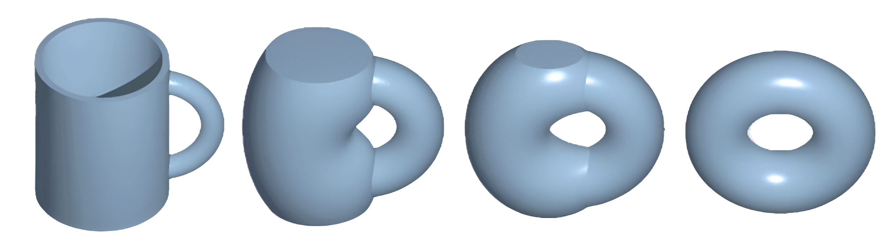

  

# Hello there! 🧙🏼‍♂️🪄

I'm **Daniel**, a Mathematics and Statistics double major, Computer Science minor student at [Colby College](https://www.colby.edu/).

This GitHub is where I keep track of my projects and notes, both in programming and mathematics. It's a collection of things I've built, things I'm learning, and ideas I find interesting.

I'm always happy to chat about **math**, **coding**, **Harry Potter**, **music**, or whatever interesting topic that happens to come up.

📫 You can reach me at:
- Email: [danieltle0602@gmail.com](mailto:danieltle0602@gmail.com)
- Email (.edu): [dtle28@colby.edu](mailto:dtle28@colby.edu)
- LinkedIn: [Daniel Le](https://www.linkedin.com/in/danielle06/)

🎶 When I'm bored, I do music ratings. You can find me rating albums here: [musicboard](https://www.musicboard.app/zlqtljstk).

Thanks for visiting my page, and I hope you find something interesting here!

P.S.: My favourite mathematical objects are [Hausdorff spaces](https://en.wikipedia.org/wiki/Hausdorff_space). Can you imagine everyone having all that space for themselves? 
